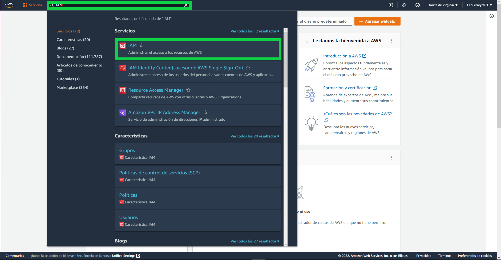
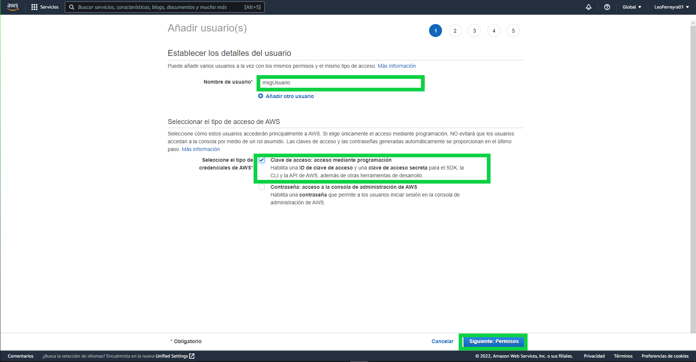
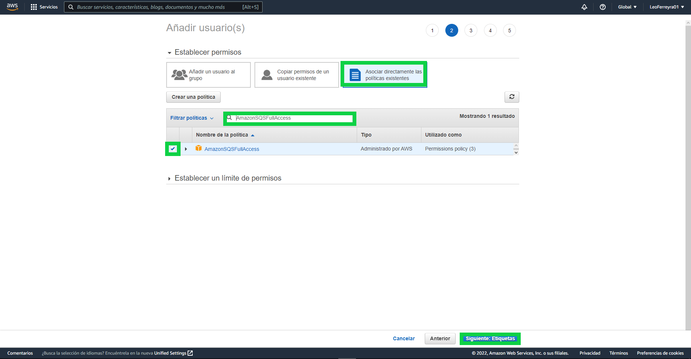
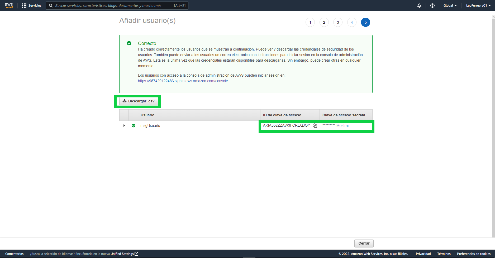

# Metodología mediante comandos con serverless

# Instalacion de Dependencias.

- Una vez tenemos esta carpeta en nuestro local, vamos a correr el comando "npm install" para instalar todas las dependencias que estan incluidas en package.json

# Crear usuario con permisos.

- Ahora que tenemos nuestras dependencias vamos a crear un usuario con los permisos para que nuestras funciones lambda se puedan comunicar correctamente. Para ello vamos a nuestra cuenta en AWS y buscamos IAM.

  

- Una vez alli vamos dirigirnos a Usuarios en el panel izquierdo y luego daremos click en agregar usuarios.

- Ahora le asignaremos un nombre al usuario y seleccionaremos en el tipo de acceso AWS "clave de accesso: acceso mediante programación". Luego daremos click en Siguiente.

  

- Luego le agregaremos los permisos que va a poseer el usuario, seleccionaremos Asociar diferentes politicas existentes, y buscaremos y tildaremos las siguientes politicas: 
  + AmazonSQSFullAccess
  + CloudWatchLogsFullAccess
  + Opcional: AdministratorAccess
- Luego daremos click en Siguiente.

  

- Luego daremos Siguiente, ya que en este caso no añadiremos ninguna Etiqueta.

- En el siguiente paso podemos revisar que hayamos añadido los servicios que estan mencionados mas arriba. Luego daremos a Crear un Usuario.

- **IMPORTANTE:** En este paso es muy imporante que le den click a descargar .csv o bien copien y pegen en algun lado las claves que les estan otorgando, ya que no las van a poder ver mas adelante.

  

# Creacion del .env

- Una vez instaladas las dependencias y creado el usuario en nuestra cuenta AWS, vamos a crear un archivo con el nombre .env dentro de nuestra carpeta contenedora (A la misma altura del package.json). Dentro de este .env vamos a añadir las credenciales de nuestra cuenta de AWS y del usuario creado. El formato es el siguiente: 
  + ACCOUNT_ID=<Your Account ID>
  + AWS_ACCESS_KEY_ID=<Your Access key ID>
  + AWS_SECRET_ACCESS_KEY=<Your secret Access Key>
- Los ultimos dos los generamos al crear el usuario que creamos con anterioridad.

# Logearse en serverless

- Ya en los ultimos pasos tenemos que logearnos en serverless para poder deployar nuestra aplicion. Para ello pondremos el comando serverless login en nuestra consola de comandos, esto nos redigira a la pagina de serverless. De no ser asi se nos proporciona un Link al cual ir.

  

- Una vez redirigido seleccionan el metodo para logearse (Recomendado Github), autorizan a la app a utilizar la info de Github. Luego crear su nombre de usuario y una vez le aparezca la siguiente imagen en pantalla pueden seguir con los siguientes pasos.

  

# Ultimas configuraciones

- Como ultimo, antes de correr nuestra aplicacion, tendríamos que configurar dos cosas en nuestro archivo serverless.yml. Cambiaremos en ACCOUNT_ID con nuestro ACCOUNT_ID, y lo mismo con la region.

  

- Para obtener estos datos nos iremos a nuestra cuenta en AWS y clickearemos en nuestro nombre arriba a la derecha. Alli obtendremos nuestro ACCOUNT_ID. La region es la que seteamos en un inicio, para verificar que sea esa, vamos a ir arriba a la derecha y a la izquierda de nuestro nombre de usuario nos aparecera en donde esta nuestra cuenta, si clickeamos en la misma podremos ver una lista con los nombres de la region, del estilo us-east-1, copiamos en la que estemos parados y lo pegamos en nuestro archivo.

# Deployar la aplicacion

- Una vez creado nuestro archivo .env y configurado serverless.yml ya estaría disponible para el funcionamiento la applicación, simplemente corremos el comando "npm run deploy" y nuestra aplicacion comenzara a deployarse a nuestro AWS.

  

- Una vez termine de deployarse la misma, en la consola podremos ver una url en donde podremos consumir el endpoint en especifico. De igual manera se puede ver en AWS como se han creado el API Gateway, dos funciones Lambda y una cola SQS.