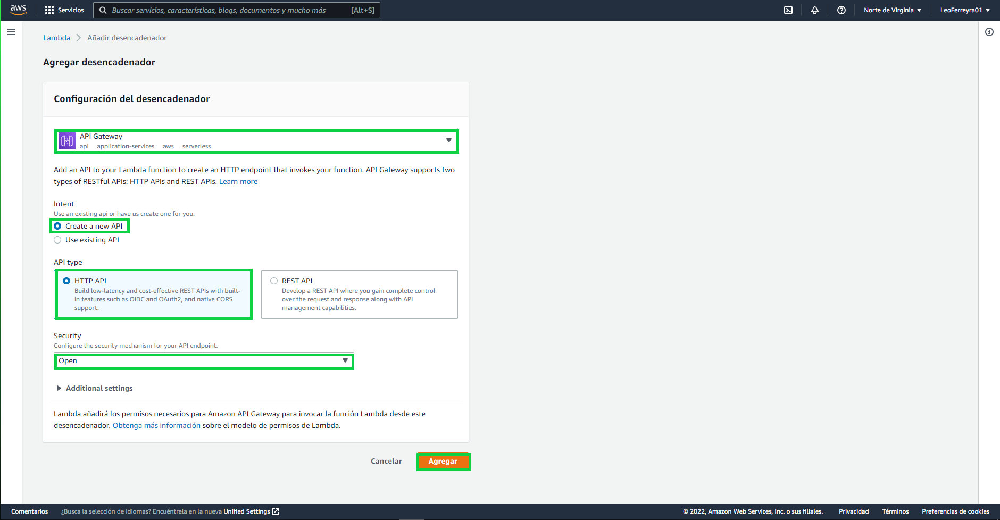

# Metodología Manual

# Creación de funciones Lambda:

- Primero y principal vamos a crear dos funciónes lambda en nuestra cuenta de AWS. Para ello nos logeamos en nuestra cuenta de AWS y buscamos Lambda en el buscador, luego vamos a la opcion que dice Lambda.

  

- Aqui crearemos nuestras dos funciones Lambda. Para ello vamos al boton que dice crear una función. Una vez allí seleccionaremos crear funcion desde cero. Le colocaremos el nombre que deseemos a nuestra función, y seleccionaremos crear una función.

  

- Una vez creada copiaremos y pegaremos en el editor la funcion que se encuentra en este repositorio y le clickearemos donde dice Deploy. Habría que repetir el procedimiento para ambas funciones.

  

# Crear Permisos/usuario/rol para el funcionamiento
- Para que nuestro entorno funcione vamos a tenes que crear un rol con unos permisos especificos para que nuestras funciones puedan acceder a nuestro API y a nuesta SQS. Para ello buscamos, de igual manera que con Lambda, IAM y seleccionamos IAM. Alli seleccionaremos Roles, y luego crear Rol.

  

-En la siguiente pesataña vamos vamos a tildar la opcion que dice servicio de AWS, vamos a tildar Lambda y damos click en siguiente.

  

- Aqui vamos a asociar las politicas, para ello vamos a buscar y tildar:
  + AmazonSQSFullAccess
  + CloudWatchLogsFullAccess
- Seleccionamos Siguiente

  

- Luego le daremos un nombe a nuestro rol y lo creamos dandole al boton de crear rol que se encuentra abajo del todo.

  

- Para finalizar asignaremos el rol que hemos creado anteriormente a nuestras funciones Lambda. Para ello buscamos Lambda como lo hemos hecho con anterioridad, seleccionamos la funcion a la que le deseemos asignar el rol (En este caso se lo vamos a asignar a las dos), nos vamos a Configuración-Permisos y en Rol de ejecución le damos en Editar.

  

- Aqui seleccionamos el Rol que acabamos de crear y le damos a guardar.

  

**IMPORTANTE:** Recuerda hacer esto ultimo para ambas Funciones (msgHandler y sqsHandler).
# Asociar Api Gateway y SQS a las funciones lambda:

## Api Gateway
- Ahora que ya tenemos creadas las funciones y los permisos asociados, tenemos que asociar a las funciones a un Api Gateway y a un SQS para darle el funcionamiento. Para esto nos vamos a la funcion llamada msgHandler y clickearemos donde dice Agregar desencadenador. Una vez alli seleccionaremos Api Gateway, luego Create a new Api, HTTP API, y en security pondremos Open, luego Agregar

  

- Para configurar la misma, en la función lambda a la que le asociamos el Api Gateway, vamos a Configuración y luego clickeamos en Desencadenadores y allí clickeamos en el nombre de la Api que creamos.

  

- Una vez en el panel, nos dirigimos en donde dice Rutas, alli seleccionamos el método que por defecto es ANY, selccionamos Editar, cambiamos ANY por POST, guardamos y ya estaría listo el Api Gateway.

  

## SQS
- De igual manera que buscamos Lambda vamos a buscar SQS y seleccionamos Simple Queue Service. Una vez alli clickeamos en crear una cola. Aqui simplemente seleccionamos Estandar y le ponemos de nombre MyQueue. Bajamos y le damos en crear cola.

  

- Una vez creada la cola tenemos que poner nuesta función lambda para que tome los mensajes de la cola. Para ello clickeamos en Desencadenadores de Lambda dentro de nuesta cola recien creada, allí clickeamos en configurar desencadenador de función Lambda.

  

- Aqui seleccionamos la funcion que se llame sqsHanlder y le damos a Guardar.

  

# Pasos Finales

- Ahora que ya tenemos todo configurado hay que hacer un pequeño cambio y ya podríamos utilizar nuestra implementación. En la pestaña de SQS vamos a copiar el url que nos provee la misma.

  

- Una vez copiamos ese Link nos dirigiremos a la funcion lambda msgHandler y pegaremos la misma en la constante creada al inicio de la funcion y le daremos a Deploy. La constante se llama sqsURL.

  

- Ahora ya esta todo listo y funcional, simplemente nos copiamos el endpoint que nos provee el API Gateway y lo podemos poner en Postman para probarlo.

  

